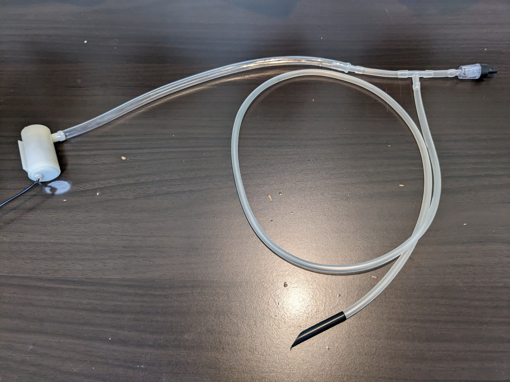
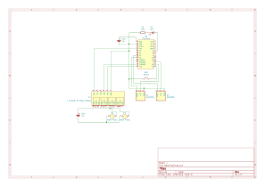

# Watering
Watering system built with [WayinTop's DIY kit](https://github.com/WayinTop/Automatic-Watering-System-JP).

## How to use
It checks the values of soil moisture sensors periodicaly (2 hours by default) and run the pumps if it is dry (the sensor value is higher than threshold). You can omit sensors by commenting out `#define SENSOR_ON`.

The board sleeps while the interval except for the LED blinks every 8 seconds. The interval is canceled while the button is pushed.

## Build tips
- Power supplies
  - Arduino board and water pumps should not share power supply because the board cannot operate due to power shortage when pumps run.
  - Any 5V DC power supply will do for the board but using a mobile battery might not be a good idea if the system operates outdoor. You could use dry batteries with a DC/DC converter instead (e.g. 3V to 5V by 2 AA size batteries with a step-up DC/DC converter).
  - The water pumps are for 3V but it actually works with 1.5V battery.
However, you should not run multiple pumps simultaneously so that each pump work properly.
- Power saving
  - You could use sleep mode properly to save power (see `setupWDT` and `deepSleep` in the code).
  - The soil moisture sensors consumes power even in sleep mode (about 10 mA per unit). Using output pins as VCC of the sensors can save it.
- Water tubes
  - You should put check bulbs in between the water tubes if the tube outlets are lower than a tank so that the tubes don't siphon off water. 

## Bill of Materials
|Ref|Qnty|Part|Note|
|---|----|---------|----|
|K1|1|[4 channel relay module](https://components101.com/sites/default/files/component_datasheet/Four-Channel-Relay-Module-Datasheet.pdf)|Included in the kit|
|P1, P2|2|[Water Pump](https://m.eleparts.co.kr/data/goods_attach/202207/good-pdf-11902681-1.pdf)|Included in the kit|
|U1, U2|2|[Soil Moisture Sensor](https://media.digikey.com/pdf/data%20sheets/dfrobot%20pdfs/sen0193_web.pdf)|Included in the kit|
| |1|Tube (inner diameter 5-6mm)|Included in the kit|
|B1|1|[Pro Micro](https://learn.sparkfun.com/tutorials/pro-micro--fio-v3-hookup-guide) or any Arduino board|    |
|BT1|1|5V DC battery|Power supply for Pro Micro|
|BT2|1|3V (or any) DC battery|Power supply for water pumps|
|D1|1|LED| |
|R1|1|1kΩ Register| |
|SW1|1|Push Switch| |
| |2|Check bulb|To stop siphoning off water|
| |1|Tube (inner diameter 4mm)|To connect check bulbs|
| |2|Tee tube connector|To connect check bulbs|

